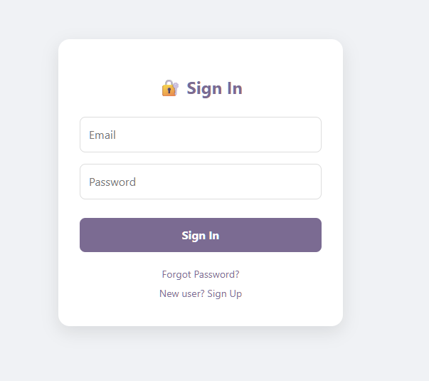
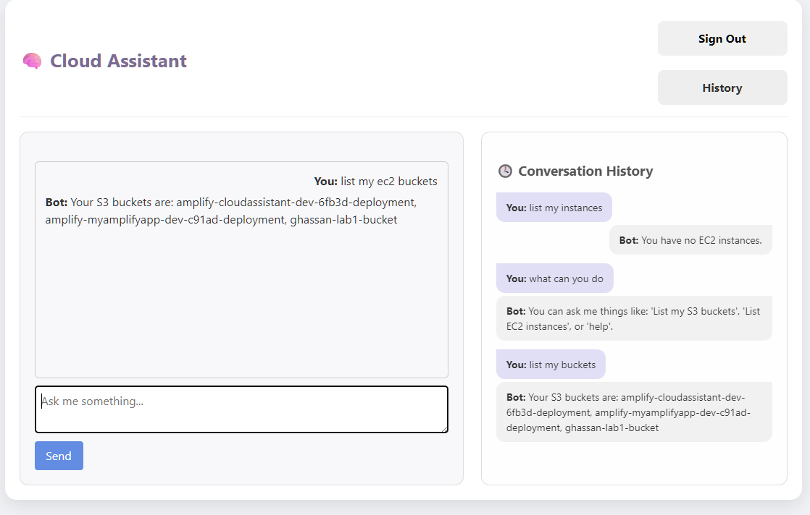

# Cloud Assistant: Serverless Conversational AI for AWS

## Project Title

Cloud Assistant: An AI-Powered Conversational Interface for AWS

## Concise Description

The Cloud Assistant is a web application that provides a conversational interface for interacting with AWS services.  Users can use natural language to perform AWS operations, automating tasks and simplifying cloud management.  The application is built using a serverless architecture, leveraging AWS Amplify, Amazon Lex, and other AWS services.

## Architecture Diagram

Architecture Diagram:
+-----------------+         User Authentication         +-----------------+         Intent Fulfillment         +-----------------+         Data Persistence
|  Amazon Cognito |------------------------------------->|  AWS Amplify (React.js)  |------------------------------------->|  Amazon Lex  |------------------------------------->|  AWS Lambda     |------------------------------------->|  DynamoDB     |
+-----------------+         Frontend                    +-----------------+         Natural Language Processing         +-----------------+         Backend Logic             +-----------------+
                                                                 |
                                                                 | User Input
                                                                 |
                                                                 v
                                                         +--------------+
                                                         | GraphQL API  |
                                                         | (AWS AppSync)|
                                                         +--------------+
                                                                 |
                                                                 | AWS SDK
                                                                 |
                                                                 v
                                                         +--------------+
                                                         | AWS Services |## Step-by-Step Installation Instructions

1.  **Prerequisites:**

    * An AWS account with appropriate permissions.
    * Node.js and npm installed.
    * AWS Amplify CLI installed and configured.
    * Git for version control.

2.  **Clone the Repository:**

    ```
    git clone https://github.com/GhassanMaq/CloudAssistant
    cd CloudAssistant
    ```

3.  **Install Frontend Dependencies:**

    ```
    npm install
    ```

4.  **Set up AWS Amplify:**

    * If you haven't already, install the Amplify CLI:

        ```
        npm install -g @aws-amplify/cli
        ```

    * Configure the Amplify CLI:

        ```
        amplify configure
        ```

    * Initialize Amplify in your project:

        ```
        amplify init
        ```

    * Follow the prompts to set up your Amplify environment.

5.  **Deploy the Backend:**

    ```
    amplify push
    ```

6.  **Configure Environment Variables:**

    * If necessary, set any required environment variables for your Lambda functions or other backend resources. This might include API keys, database connection strings, etc.

7.  **Lex Bot Deployment**

    * Import the Lex bot definition file into your AWS Lex console.
    * Build and publish the bot.
    * Configure the necessary Lambda function for intent fulfillment.

8.  **Frontend Configuration:**

    * Ensure that the `aws-exports.js` file is correctly configured with your AWS resources. This file is typically generated by the `amplify init` and `amplify push` commands.

9.  **Run the Application:**

    ```
    npm start
    ```

10. **Access the Application:**

    * The application should now be running in your browser, typically at `http://localhost:3000`.

## Configuration Requirements and Environment Setup

* **AWS Account:** You will need an AWS account with sufficient permissions to create and manage the following resources:

    * IAM Users, Groups, and Roles
    * Cognito User Pools
    * Amplify Applications
    * Lex Bots
    * Lambda Functions
    * AppSync APIs
    * DynamoDB Tables

* **IAM Permissions:** Properly configured IAM roles and policies are crucial for the application to function securely. The following IAM setup is recommended:

    * A group for Frontend Developers with permissions for Cognito, Amplify Console, CloudFormation (read-only), and Lex (for testing).
    * A group for Backend Developers with permissions for Lambda, API Gateway, DynamoDB, AppSync, IAM (read-only), Lex, and S3.
    * A group for DevOps with permissions for CloudFormation, S3, IAM (with caution), and Amplify Console.
    * IAM roles for Lambda functions and Lex to access other AWS services.

* **AWS Amplify CLI:** The Amplify CLI needs to be configured with your AWS credentials to deploy and manage the application's backend.

* **Environment Variables:** Set any necessary environment variables as required by your Lambda functions.

## Usage Examples with Screenshots



## API Reference for your GraphQL Schema


**Queries:**

* `listConversations`: Retrieves a list of user conversations.

**Mutations:**

* `createConversation`: Creates a new conversation entry.

## Information about Lex Intents and Slots

The Amazon Lex bot is designed to understand natural language queries related to AWS operations. Key intents include:

* `DescribeS3Buckets`: Lists the user's S3 buckets.
* `ListEC2Instances`: Lists the user's EC2 instances.
* `HelpIntent1`: Provides information about the bot's capabilities.

Each intent may use slots to capture specific information from the user's input. For example, a future intent to describe a specific EC2 instance might use a slot to capture the Instance ID.

## Deployment Instructions

1.  **Using AWS Amplify Hosting (Recommended):**

    * Connect your Git branch to the Amplify Console. This enables full-stack CI/CD, automatically deploying changes to both the frontend and backend when you commit code.

2.  **Manual Deployments:**

    * Use the Amplify CLI to publish your changes:

        ```
        amplify publish
        ```

    * This command builds and publishes both the backend and the frontend of your project.
